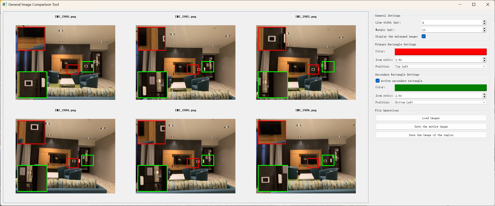
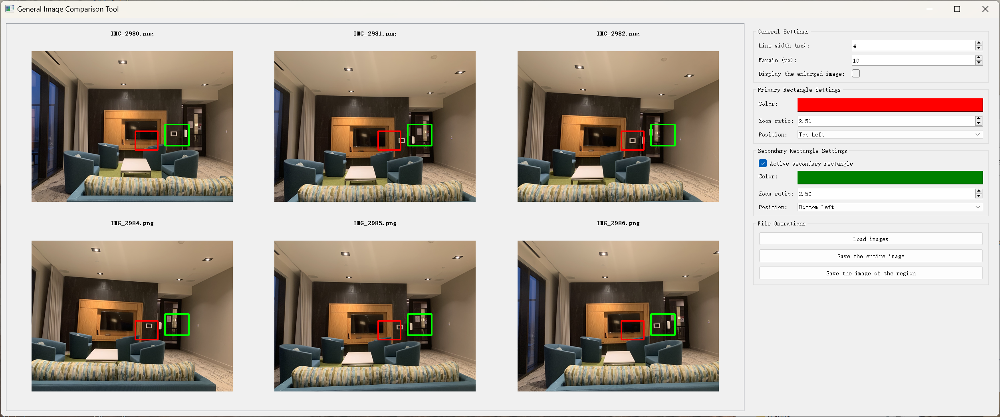

# GICT: General Image Comparison Tool

The main features of this tool are: Select multiple images for comparison, support zooming in on specific areas of the image, set line width and margins, support up to two rectangular zoomed-in views, and save specific areas.

## How to Run?
- Download the compiled executable (*.exe) or compile from source (Two versions are provided: Chinese (-CN) and English  (-EN) ).

## Features

* Lightweight image editing tool.

* Supports zooming in on specific areas and saving.

  

## Examples

1. Zoom in & display on two areas.

2. Zoom in on two areas.

3. Save specific areas image.

